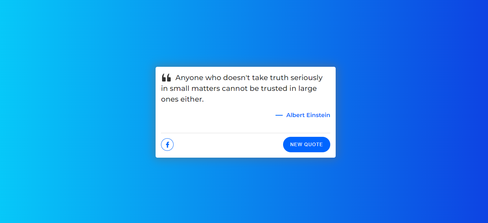

# DESIGN STOCK

## 🔴[LIVE DEMO](https://design-stock.vercel.app)



### 🛠 Technologies used:-

- React Js
- create-react-app
- SCSS
- Bootstrap 5
- react-icons
- react-hot-toast
- react-router-dom

### Run Locally:-

Clone the project

```bash
  git clone https://github.com/mhhasanmehedi/design-stock.git
```

Go to the project directory

```bash
  cd design-stock
```

Install dependencies

```bash
  npm install
```

Start the server

```bash
  npm start
```

### 🔗 Follow Me:-

[](https://mehedihasanrahat.vercel.app/)
[](https://www.linkedin.com/in/mhhasanmehedi/)
[](https://twitter.com/mhhasanmehedi)
